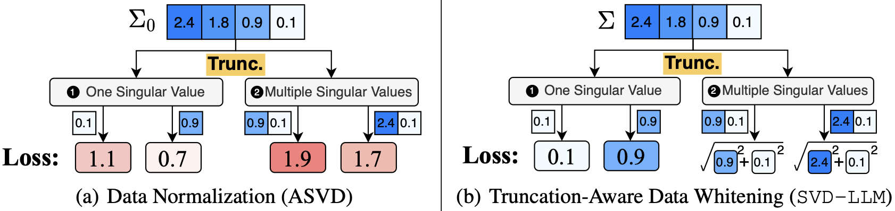
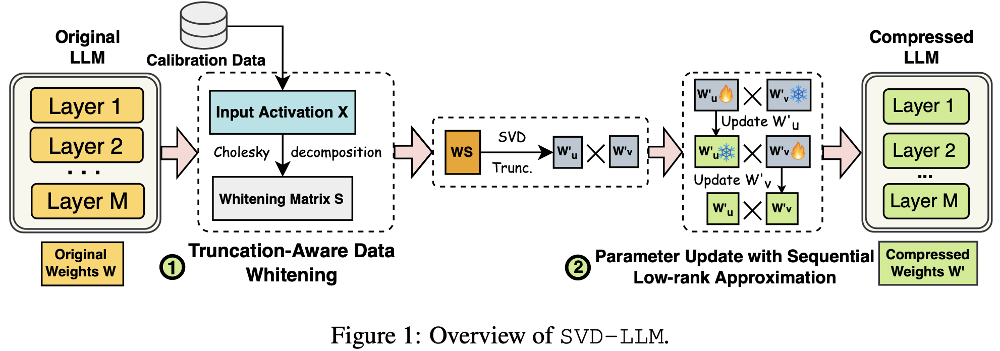
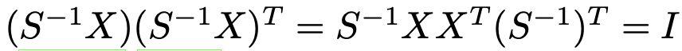

# SVD-π3: Efficient Visual Geometry Learning via Singular Value Decomposition

## SVD-LLM

Motivation: in ASVD, truncating the smallest singular values **does not guarantee** minimal loss, hence we want to achieve a **direct mapping** between singular values and compression loss.



Instead of a simple/naive **scaling matrix** illustrated in [ASVD](docs/ASVD_2.png), we can use a **whitening matrix** $S$ 



this **whitening matrix** is computed such that it satisfies the following property:



## SVD-LLM preliminaries

### Truncation-Aware Data Whitening

using the calibration dataset for data whitening:

```bash
CUDA_VISIBLE_DEVICES=<whichever_is_free> python SVDLLM.py --model jeffwan/llama-7b-hf --step 1 --ratio 0.2 --whitening_nsamples 256 --dataset wikitext2 --seed 3 --model_seq_len 2048 --save_path . --run_low_resource
```

perplexity evaluation:

```bash
CUDA_VISIBLE_DEVICES=<whichever_is_free> taskset -c 30-40 python SVDLLM.py --step 4 --model_path jeffwan_llama_7b_hf_whitening_only_0.8.pt
```

```java
PPL after pruning: {'wikitext2': 7.886700954800093}
Weight Memory: 22004.896484375 MiB
```

efficiency evaluation:

```bash
CUDA_VISIBLE_DEVICES=<whichever_is_free> taskset -c 30-40 python SVDLLM.py --step 5 --model_path jeffwan_llama_7b_hf_whitening_only_0.8.pt
```

```java
Total Memory: 28.538090705871582 GB
Weight Memory: 20.503570556640625 GB
Activation Memory: 8.026554107666016 GB
Throughput: 69.48256829185354 tokens/sec
```

### Finetuning with LoRA

update W'u (~35 hours):

```bash
CUDA_VISIBLE_DEVICES=<whichever_is_free> nohup taskset -c 30-40 python utils/LoRA.py --prune_model jeffwan_llama_7b_hf_whitening_only_0.8.pt --data_path yahma/alpaca-cleaned --output_dir ./first_half --lora_target_modules q_u_proj,k_u_proj,v_u_proj,o_u_proj,gate_u_proj,down_u_proj,up_u_proj --lora_r 8 --num_epochs 3 --learning_rate 1e-4 --batch_size 4 --micro_batch_size 1 --cutoff_len 1024 --group_by_length &
```

```java
{'train_runtime': 128586.2054, 'train_samples_per_second': 1.161, 'train_steps_per_second': 0.29, 'train_loss': 1.0868874290876194, 'epoch': 3.0}
```

Immediate evaluation:

```bash
CUDA_VISIBLE_DEVICES=<whichever_is_free> taskset -c 30-40 python SVDLLM.py --model_path jeffwan_llama_7b_hf_whitening_only_0.8.pt --lora ./first_half --step 4
```

```java
PPL after pruning: {'wikitext2': 7.23282080013519}
Weight Memory: 22004.896484375 MiB
```

Update W'v:

```bash
CUDA_VISIBLE_DEVICES=<whichever_is_free> nohup taskset -c 30-40 python utils/LoRA.py --prune_model ./first_half/merge.pt --data_path yahma/alpaca-cleaned --output_dir ./second_half --lora_target_modules q_v_proj,k_v_proj,v_v_proj,o_v_proj,gate_v_proj,down_v_proj,up_v_proj --lora_r 8 --num_epochs 3 --learning_rate 1e-4 --batch_size 4 --micro_batch_size 1 --cutoff_len 1024 --group_by_length &
```

Immediate evaluation:

```bash
PYTHONNOUSERSITE=1 CUDA_VISIBLE_DEVICES=0 taskset -c 30-40 python SVDLLM.py --model_path jeffwan_llama_7b_hf_whitening_only_0.8.pt --lora ./first_half /first_half --step 4
```

```java
coming soon!
```

Final evaluation:

```bash
PYTHONNOUSERSITE=1 CUDA_VISIBLE_DEVICES=0 taskset -c 30-40 python SVDLLM.py --model_path ./first_half/merge.pt --lora ./second_half --step 4
```

## Efficiency Measurement

HuggingFace repo for π3 model: [yyfz233/Pi3](https://huggingface.co/yyfz233/Pi3)

get forward pass (ms) and throughput (frames/sec):

```bash
CUDA_VISIBLE_DEVICES=0 python example.py --ckpt ./pi3_model.safetensors --efficiency_measure simple
```

| model | forward pass (ms) | throughput (frames/sec) |
| ----- | ----------------- | ----------------------- |
| original π3 | 1530.90 | 7.19 |
| SVD-π3 (coming soon!) | ? | ? |

detailed profiling:

```bash
CUDA_VISIBLE_DEVICES=0 python example.py --ckpt ./pi3_model.safetensors --efficiency_measure profiler
```

</img>


## SVD-π3 Implementation Roadmap

- [ ] Truncation-Aware Data Whitening
  - [ ] calibration dataset collection
  - [ ] TBD
- [ ] Finetuning with LoRA
  - [ ] TBD


## Evaluation

### Monocular Depth Estimation

### Video Depth Estimation

### Relative Camera Pose Estimation

### Point Map Estimation
