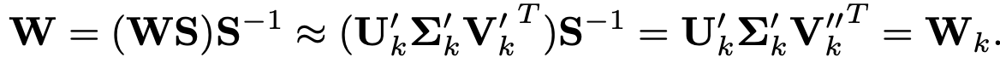
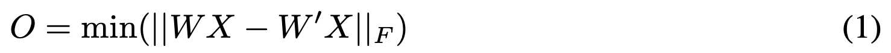

# SVD-VGGT: Efficient Visual Geometry Grounded Transformer via Singular Value Decomposition

## ASVD

Activation-aware SVD (basically normalizing the activation):

where a **scaling matrix** $S$ (which is diagonal) can be derived as follows ($X$ is the input activation):

training objective (shared by SVD-LLM too):

## SVD-LLM

Motivation: in ASVD, truncating the smallest singular values **does not guarantee** minimal loss, hence we want to achieve a **direct mapping** between singular values and compression loss.

Instead of a simple/naive **scaling matrix** illustrated in [ASVD](docs/ASVD_2.png), we can use a **whitening matrix** $S$ 

this **whitening matrix** satisfies:

## model design

## experiment design

Baseline: original VGGT

