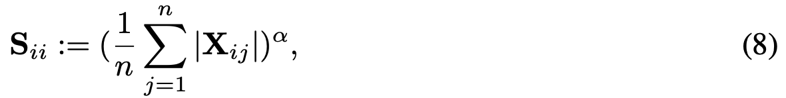

# SVD-VGGT: Efficient Visual Geometry Grounded Transformer via Singular Value Decomposition

## ASVD

Activation-aware SVD (basically normalizing the activation):


where a **scaling matrix** $S$ (which is diagonal) can be derived as follows ($X$ is the input activation):



training objective (shared by SVD-LLM too):


## SVD-LLM

Motivation: in ASVD, truncating the smallest singular values **does not guarantee** minimal loss, hence we want to achieve a **direct mapping** between singular values and compression loss.


Instead of a simple/naive **scaling matrix** illustrated in [ASVD](docs/ASVD_2.png), we can use a **whitening matrix** $S$ 


this **whitening matrix** is computed such that it satisfies the following property:


## brainstorming

SVD-VGGT

1. baseline: original VGGT, compare GFLOPs etc.
2. benchmark among 3 different ways of doing SVD: 
    1. vanilla-SVD-based
    2. ASVD-based (scaling matrix to make it activation aware)
    3. SVD-LLM-based (whitening matrix to create a direct mapping between singular values and compression loss)

Alternative idea:

1. SVD-ViT (VGGT is already for multi-task, but maybe ViT has **broader impacts**?)
    1. use the whitening + param update introduced from SVD-LLM
    2. compare with existing ViT-related work like [Efficient Adaptation of Pre-trained Vision Transformer via Householder Transformation](https://arxiv.org/pdf/2410.22952)


## VGGT inference


## SVD-LLM preliminaries

### Truncation-Aware Data Whitening

using the calibration dataset for data whitening:

```bash
CUDA_VISIBLE_DEVICES=0 taskset -c 30-40 python SVDLLM.py --model jeffwan/llama-7b-hf --step 1 --ratio 0.2 --whitening_nsamples 256 --dataset wikitext2 --seed 3 --model_seq_len 2048 --save_path .
```

perplexity evaluation:

```bash
CUDA_VISIBLE_DEVICES=0 taskset -c 30-40 python SVDLLM.py --step 4 --model_path jeffwan_llama_7b_hf_whitening_only_0.8.pt
```

```java
PPL after pruning: {'wikitext2': 7.886706595810216}
Weight Memory: 22008.912109375 MiB
```

### Finetuning with LoRA

debugging...
