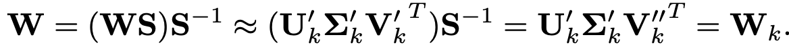
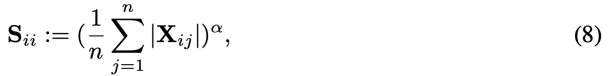
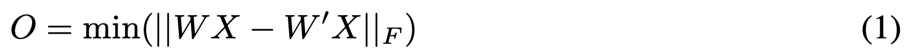
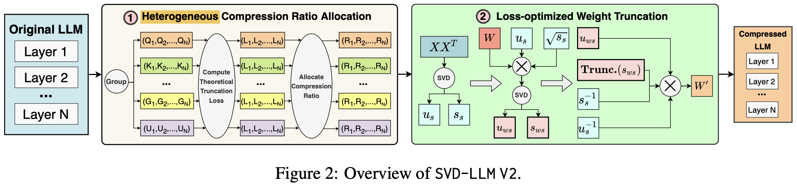
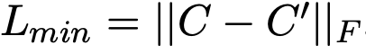
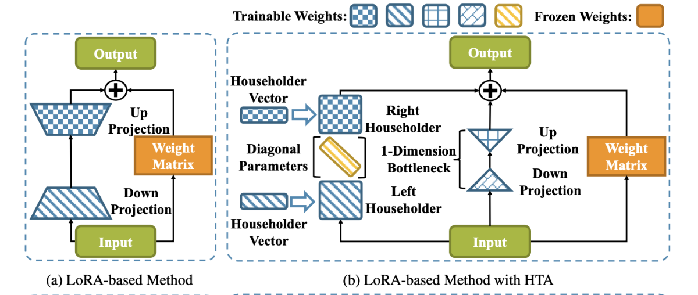
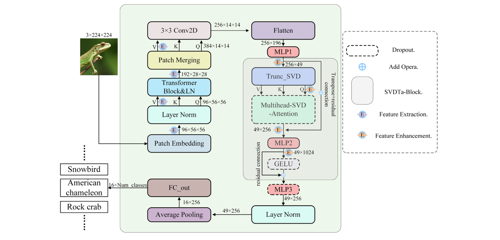
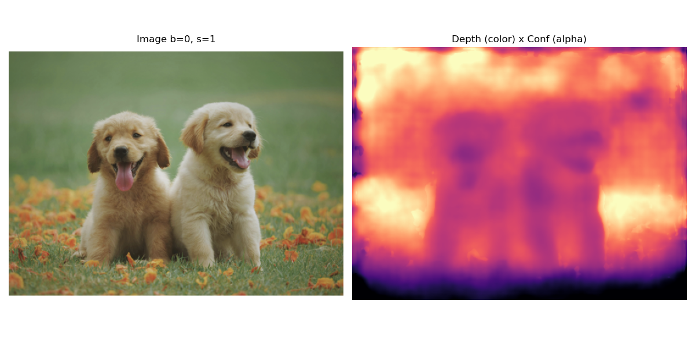
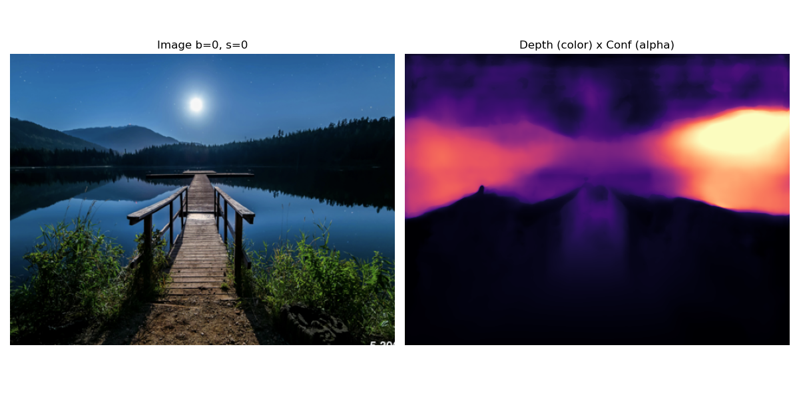
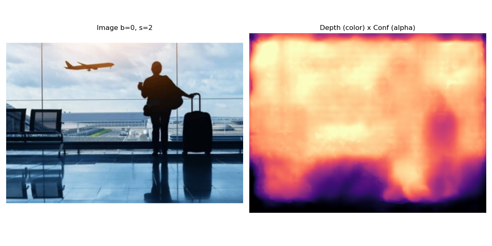

# Related Work

## ASVD

Activation-aware SVD (basically normalizing the activation):

where a **scaling matrix** $S$ (which is diagonal) can be derived as follows ($X$ is the input activation):

training objective (shared by SVD-LLM too):

## SVD-LLM (V2)

adaptive compression ratio + two rounds SVD for finetuning:

| assigned ratio | min truncation loss |
| ---- | ----- |
|  | |

## Householder Transformation

Apply householder transformation to achieve flexible bottleneck dimensionality:

## SVDFormer

A shallow feature extraction module with a feature enhancement module (with SVD-attention):

# VGGT inference

